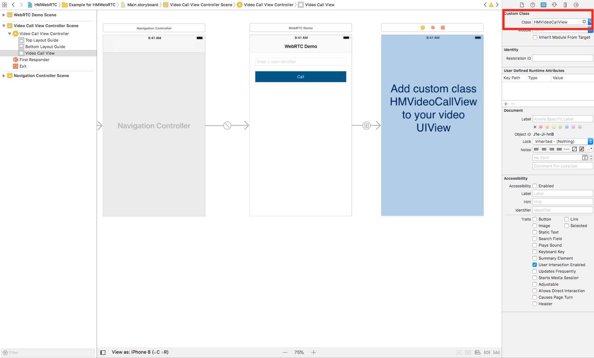

# HMWebRTC

[](https://travis-ci.org/tdhman/HMWebRTC)
[](https://cocoapods.org/pods/HMWebRTC)
[](https://cocoapods.org/pods/HMWebRTC)
[](https://cocoapods.org/pods/HMWebRTC)

## Example

To run the example project, clone the repo, and run `pod install` from the Example directory first.

The example application use the current [Google AppRTC Web Server](https://appr.tc)

## Installation

HMWebRTC is available through [CocoaPods](https://cocoapods.org). To install
it, simply add the following line to your Podfile:

```ruby
pod 'HMWebRTC'
```

## Dependencies

The [GoogleWebRPC](https://cocoapods.org/pods/GoogleWebRTC) is now available on CocoaPods, however, it cannot be used directly in a client application, some required steps / configurations are needed as shown in the [SDK example for iOS](https://chromium.googlesource.com/external/webrtc/+/master/examples/objc/).

In order to facilitate its usage, this project wraps the necessary modules of the working example on iOS in order to be reused directly on other project using cocoapod.

## Features

The project is shipped with the WebRTC client modules that's ready to be used. Refer to the demo application for its manual usage.

On the other hand, this cocoapod contains also the video chat's UI + view controller that's pre-configured and is ready to be embedded in other project.


### Using the HMWebRTC in your app

After installing the framework, some pre-configuration must be done in order to make it works.

#### Configuration the server host params

The default app client params use the current [Google WebRTC Server params](https://appr.tc/params).

Change the default config params to your WebRTC backend using the static configuration class `ARDAppClientConfig` as example below:

```
#import "HMWebRPC/ARDAppClientConfig.h"

[ARDAppClientConfig setServerHostParams:@"https://..."]
...
```

The default params for the WebRTC client:

```
static NSString * kARDRoomServerHostUrl = @"https://appr.tc";
static NSString * kARDIceServerRequestUrl = @"https://appr.tc/params";
static NSString * kARDRoomServerJoinFormat = @"https://appr.tc/join/%@";
static NSString * kARDRoomServerJoinFormatLoopback = @"https://appr.tc/join/%@?debug=loopback";
static NSString * kARDRoomServerMessageFormat = @"https://appr.tc/message/%@/%@";
static NSString * kARDRoomServerLeaveFormat = @"https://appr.tc/leave/%@/%@";
static NSString * kTURNRefererURLString = @"https://appr.tc";
```

#### Initialize/Deinitialize SSL connection on app

For example, in a video call single application:

```
# AppDelegate.m

- (BOOL)application:(UIApplication *)application didFinishLaunchingWithOptions:(NSDictionary *)launchOptions
{
    // When needed, initialize the peer SSL connection
    NSDictionary *fieldTrials = @{};
    RTCInitFieldTrialDictionary(fieldTrials);
    RTCInitializeSSL();
    RTCSetupInternalTracer();
    
    ...
    return YES;
}

- (void)applicationWillTerminate:(UIApplication *)application
{
    // Before exiting, end the current peer session
    RTCShutdownInternalTracer();
    RTCCleanupSSL();
}
```

#### Add video chat

This pod contains the UI xib for a peer-to-peer video chat view & its view controller. Simply add the xib view to your storyboard view controller's main view.



Then, on the application view that will invoke the video chat, e.g. `HMRoomViewController`, implements the delegate of the video chat's view controller 

```
@interface HMRoomViewController ()<HMVideoCallViewControllerDelegate>
...
@end
```

Next, to invoke the video chat view, simply initialize & present the view controller in your code

```
// Init the video view controller & set the room identifier
HMVideoCallViewController *videoCallViewController = [[HMVideoCallViewController alloc] initForRoom:trimmedRoom isLoopback:NO delegate:self];

// Present the view controller as modal
videoCallViewController.modalTransitionStyle = UIModalTransitionStyleCrossDissolve;
[self presentViewController:videoCallViewController animated:YES completion:nil];
```

Plus, implement the video view controller's delegate when finishing the call

```
#pragma mark - HMVideoCallViewControllerDelegate

- (void)viewControllerDidFinish:(HMVideoCallViewController *)viewController {
    if (![viewController isBeingDismissed]) {
        NSLog(@"Dismissing VC");
        [self dismissViewControllerAnimated:YES completion:nil];
    }
}
```


## License

HMWebRTC is available under the MIT license. See the LICENSE file for more info.
